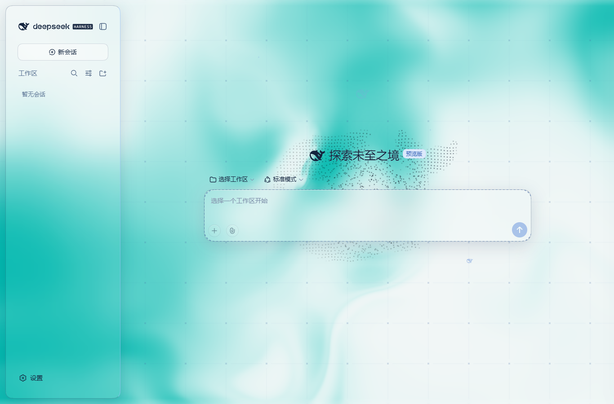
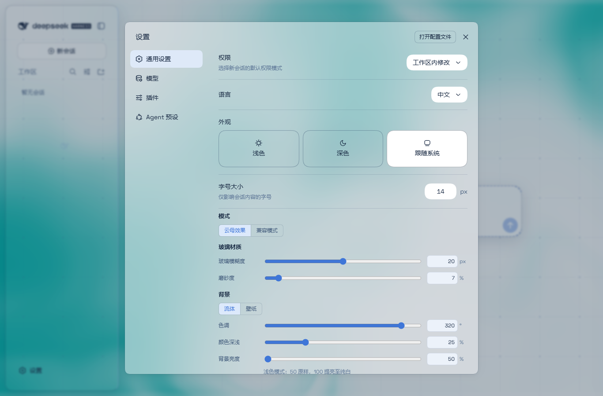

# 验证记录

日期：2026-10-01。环境：Windows，Node.js 24.19.0，pnpm 11.19.0，DSH 0.1.5-rc.1。

测试使用独立 DSH_HOME 和 `aqua-validation` profile，Web 端口 3081。日常使用的 3080 profile 未改动。

- 类型检查：通过。
- 独立构建：通过，源码与发布产物统一生成。
- 回归检查：4 项通过；覆盖 Host 命名空间、bundle 模块请求、隐藏画布恢复、Windows 安装迁移/备份/幂等及 UTF-8 中文配置。
- 安装检查：通过，在所选 profile 自己的 node_modules 建 Junction；保留其他插件和原源码目录。
- 真实 DSH Web：加载成功，4 个主题样式表注入，浏览器异常为 0；插件卡及通用设置中的玻璃控件可见。
- 开关：关闭后刷新仍保持关闭，重新开启恢复主题，检查通过。
- 窗口：1366、768、390 像素宽度下页面没有横向溢出，已保存并查看截图。这是桌面 Chrome 的视口检查，不能代替真实手机验证。
- 上述 v1.4.0/v1.4.1 检查未覆盖桌面端、DSH 0.1.6/0.2.0、真实手机及第三方侧栏插件联合运行。

测试中的本地 URL、启动 token、用户 profile 和凭据不随源码提交。

v1.4.0 的真实下载后安装检查发现 PowerShell 5.1 读取中文 JSON 的默认编码问题；v1.4.1 已明确使用 UTF-8，修复后的脚本对 GitHub 下载源码中的无 BOM 中文元数据执行安装检查通过。

浏览器使用独立的临时 headless Chrome profile；截图在入场动画结束后保存，最终回归以减少动态效果设置运行。没有输入 API Key 或向模型发送消息。

## v1.4.2 Windows 桌面版

2026-10-01，Windows DSH `0.2.0-rc.2` 已完成加载与适配。修复覆盖主对话区背景、左栏展开按钮、右栏残留竖线和输入底栏过高；用户在真实桌面窗口确认当前已无上述问题。

后台隔离检查覆盖主对话区域 16 种组合、真实右栏 wrapper 16 种组合、输入区 17 个关键用例，以及左栏按钮位置和命中检查。输入区检查包含 `dsh-cost-meter`，费用信息保留完整，长草稿和窄窗没有横向溢出。关闭主题后恢复官方背景、边框与布局。

这些隔离检查与用户的真实窗口确认分别记录，不将隔离截图冒充真实应用截图。具体版本、安装方法和检查范围见 [桌面版说明](DESKTOP.md)。
